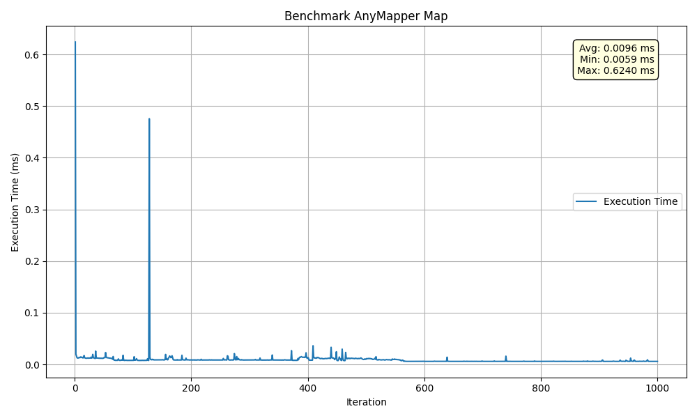
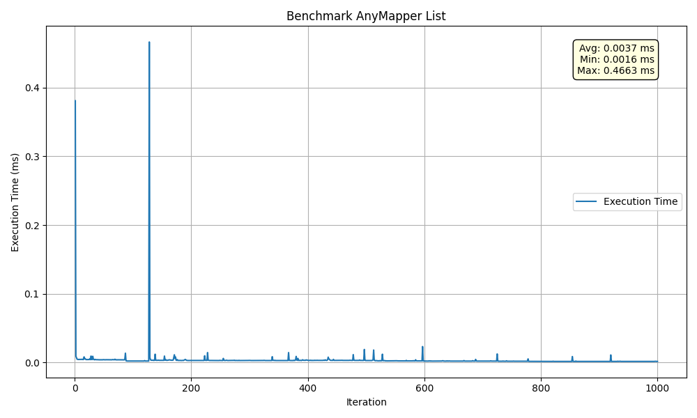

# AnyMapper

AnyMapper is a lightweight Java library for transforming deeply nested Map<String, Object> structures into different shapes based on a declarative mapping configuration. It supports both flat and nested remapping of keys and values, including intelligent handling of List<Map<...>> structures. Designed for flexibility and extensibility, AnyMapper simplifies data transformation pipelines without the need for boilerplate code or rigid DTO classes.

Use cases
  - Mapping external API payloads to internal formats
  - Normalizing deeply nested data for indexing (e.g., Elasticsearch)
  - Extracting or flattening complex JSON-like maps
  - Structuring data before serialization or persistence

---

# Table of contents

- [Features](#features)
- [Installation](#installation)
    - [Maven](#maven)
    - [Gradle](#gradle)
- [Integration](#integration)
    - [toMap](#tomap)
- [Usage](#usage)
    - [Map Transformation](#map-transformation)
        - [Input](#input)
        - [Configuration](#configuration)
        - [Result](#result)
    - [List Transformation](#list-transformation)
        - [Input](#input)
        - [Configuration](#configuration)
        - [Result](#result)
    - [Like-for-Like Transformation](#like-for-like-transformation)
        - [Input](#input)
        - [Configuration](#configuration)
        - [Result](#result)
    - [Complex Example](#complex-example)
        - [Input](#input)
        - [Configuration](#configuration)
        - [Result](#result)
- [License](#license)
- [🤝 Contributing](#-contributing)

---

# Features

- Declarative transformation mapping
- Supports nested maps and lists
- Minimal footprint and zero dependencies
- Preserves insertion order
- Easy to integrate into any JVM project

---

# Installation

Maven Central: [LINK](https://central.sonatype.com/artifact/com.moftium/anymapper)

### Maven

```xml
<dependency>
    <groupId>com.moftium</groupId>
    <artifactId>anymapper</artifactId>
    <version>1.0.0</version>
</dependency>
```
    
### Gradle

```groovy
    implementation group: 'com.moftium', name: 'anymapper', version: '1.0.0'
```

---

# Integration
an example on how would you instantiate AnyMapper template and execute a transformation

## toMap
```java
    AnyMapper anyMapper = new AnyMapper(config);
    Map<String, Object> output = anyMapper.transform(input);
```

---

# Usage
AnyMapper is ideal when you need a clean separation between external and internal data structures without writing boilerplate transformation code.

Common scenarios include:
- Intermediate integration layers: You're integrating with multiple third-party services, each returning different payload structures. Use AnyMapper to convert them into a normalized internal format that your system consistently works with.
- Internal to external response shaping: You want to hide internal details, restructure deeply nested objects, or omit sensitive data before sending responses to customers or frontend applications.

## Map Transformation
when transforming a map, the only configuration needed is the `destination` field.

### Input
```json
{
  "id": "5abbe4b7ddc1b351ef961414",
  "dateLastActivity": "2019-09-16T16:19:17.156Z",
  "address": {
    "firstLine": "42 X Street"
  }
}
```

### Configuration
```yaml
    id:
      destination: identifier
    address.firstLine:
      destination: record.location.address
    dateLastActivity:
      destination: record.timestamps.lastSeen
    memberIds:
      destination: record.members
```

### Result
```json
{
  "identifier": "5abbe4b7ddc1b351ef961414",
  "record": {
    "timestamps": {
      "lastSeen": "2019-09-16T16:19:17.156Z"
    },
    "location": {
      "address": "42 X Street"
    }
  }
}
```

## List Transformation
when transforming a list, you have the flexibility to transform the structure of the elements in the list, the same way you have it during a map transformation. Next to the `destination` field nest the element mappings under the `items` field

### Input
```json
{
  "id": "5abbe4b7ddc1b351ef961414",
  "dateLastActivity": "2019-09-16T16:19:17.156Z",
  "memberIds": [
    {
      "id": "mem_01",
      "name":"John Doe"
    },
    {
      "id": "mem_02",
      "name":"Jane Doe"
    }
  ]
}
```

### Configuration
```yaml
    id:
      destination: identifier
    dateLastActivity:
      destination: record.timestamps.lastSeen
    memberIds:
      destination: record.members
      items:
        id:
          destination: memberId
        name:
          destination: details.name
```

### Result
```json
{
  "identifier": "5abbe4b7ddc1b351ef961414",
  "record": {
    "timestamps": {
      "lastSeen": "2019-09-16T16:19:17.156Z"
    },
    "members": [
      {
        "memberId": "mem_01",
        "details": {
          "name": "John Doe"
        }
      },
      {
        "memberId": "mem_02",
        "details": {
          "name": "Jane Doe"
        }
      }
    ]
  }
}
```

## Like-for-Like Transformation
sometimes you don't want to remap the entire structure and don't need to change the key values, the only level which is mandatory to map is the root level

### Input
```json
{
  "id": "5abbe4b7ddc1b351ef961414",
  "timestamps": {
    "lastSeen": "2019-09-16T16:19:17.156Z"
  },
  "state": {
    "options": [
      "completed",
      "in_progress",
      "not_started"
    ]
  },
  "memberIds": [
    {
      "id": "mem_01",
      "name": "John Doe"
    },
    {
      "id": "mem_02",
      "name": "Jane Doe"
    }
  ]
}
```

### Configuration
```yaml
    id:
      destination: identifier
    timestamps:
      destination: record.timestamps
    state:
      destination: record.state
    memberIds:
      destination: memberIds
```

### Result
```json
{
  "identifier": "5abbe4b7ddc1b351ef961414",
  "record": {
    "timestamps": {
      "lastSeen": "2019-09-16T16:19:17.156Z"
    },
    "state": {
      "options": [
        "completed",
        "in_progress",
        "not_started"
      ]
    }
  },
  "memberIds": [
    {
      "id": "mem_01",
      "name": "John Doe"
    },
    {
      "id": "mem_02",
      "name": "Jane Doe"
    }
  ]
}
```

---

## Complex Example

### Input
consider the bellow json your app receives

```json
{
  "id": "5abbe4b7ddc1b351ef961414",
  "address": "42 X Street",
  "dateLastActivity": "2019-09-16T16:19:17.156Z",
  "location": true,
  "votes": 2154,
  "badges": {
    "attachmentsByType": {
      "meta": {
        "project": 12,
        "task": 34
      }
    }
  },
  "checkItemStates": [
    "completed",
    "in_progress",
    "not_started"
  ],
  "idChecklists": [
    { "id": "cl_01" },
    { "id": "cl_02" }
  ],
  "idLabels": [
    {
      "id": "lab_01",
      "labelName": "Important",
      "idMembers": ["mem_01"],
      "cover": {
        "color": "yellow",
        "idUploadedBackground": true,
        "coversIds": ["cov_01"]
      }
    }
  ]
}
```

### Configuration
the bellow yaml represents how would you configure a mapping of input above into your external response structure

```yaml
id:
  destination: record.identifier

address:
  destination: record.location.address

dateLastActivity:
  destination: record.timestamps.lastSeen

badges.attachmentsByType.meta.project:
  destination: record.metadata.projectId

badges.attachmentsByType.meta.task:
  destination: record.metadata.taskId

checkItemStates:
  destination: record.checks.statuses
  
idChecklists:
  destination: record.checks.checklists
  items:
    id:
      destination: checklistId

idLabels:
  destination: record.labels
  items:
    id:
      destination: id
    labelName:
      destination: name
    idMembers:
      destination: members
    cover.color:
      destination: visual.color
    cover.coversIds:
      destination: visual.covers
```

### Result
```json
{
  "record": {
    "identifier": "5abbe4b7ddc1b351ef961414",
    "metadata": {
      "projectId": 12,
      "taskId": 34
    },
    "checks": {
      "checklists": [
        { "checklistId": "cl_01" },
        { "checklistId": "cl_02" }
      ],
      "statuses": ["completed", "in_progress", "not_started"]
    },
    "timestamps": {
      "lastSeen": "2019-09-16T16:19:17.156Z"
    },
    "location": {
      "address": "42 Oxford Street"
    },
    "labels": [
      {
        "members": ["mem_01"],
        "name": "Important",
        "visual": {
          "color": "yellow",
          "covers": ["cov_01"]
        },
        "id": "lab_01"
      }
    ]
  }
}
```

---

# Performance

performance test: [Link](src/test/groovy/com/moftium/anymapper/performance)

## Map


## List


---
# License

This project is licensed under the [MIT License](https://opensource.org/licenses/MIT).

---

# 🤝 Contributing

PRs are welcome. Please open issues or suggestions to help improve this utility.